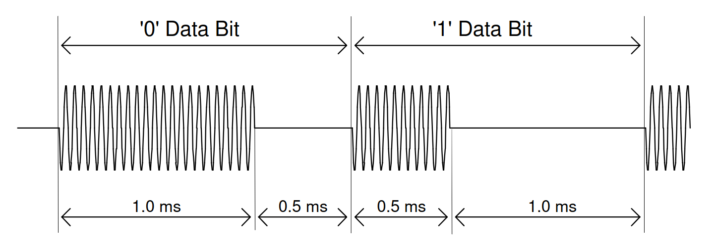

# diseqc-audio

Simple python script to send commands to a DiSEqC Motor via audio output. This was designed to control a Sattelite Positioner with a Raspberry Pi.

## DiSEqC Protocol

"The DiSEqC system is a communication bus between satellite receivers and
satellite peripheral equipment".
It works by sending both the $12\pm1V$ DC, to power the motor and all the electronics, as well as a $22 kHz (\pm 20\%)$ control signal, which should be $650 \pm 250 mV$ peak-peak, on the same coaxial cable. Firstly, we need to understand how to construct the actual message that needs to be delivered.

### Data-Bit Signalling

Starting from the smallest element of digital information, data-bit signalling "uses base-band timings of $(500\pm100)\mu s$ for a one-third bit PWK (Pulse Width Keying) coded signal period on a nominal $22 kHz (\pm 20\%)$ carrier". This means that:

- Bit 0 - $(1.0\pm0.2)ms$ tone, nominally 22 cycles, followed by $(0.5\pm0.1)ms$ of silence

- Bit 1 - $(0.5\pm0.1)ms$ tone, nominally 11 cycles, followed by $(1.0\pm0.2)ms$ of silence

