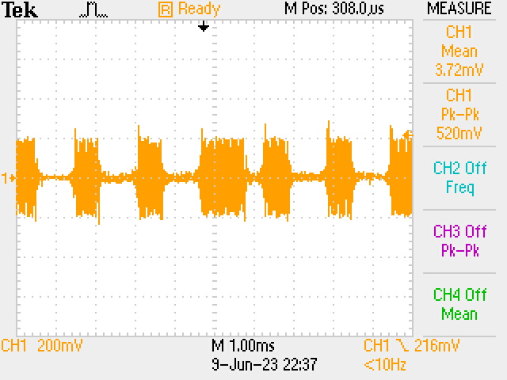
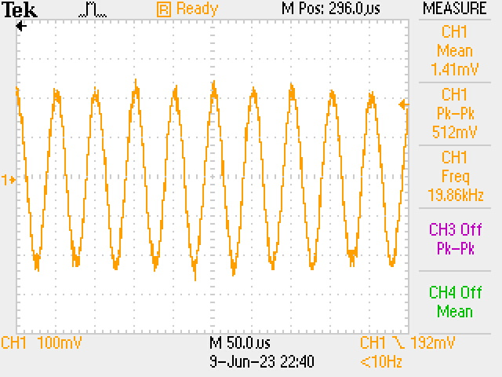
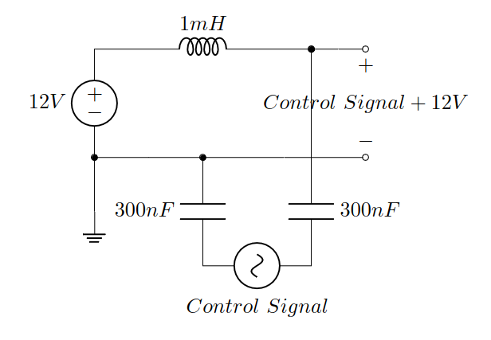

# diseqc-audio

Simple python script to send commands to a DiSEqC Motor via audio output. This was designed to control a Sattelite Positioner with a Raspberry Pi.

## DiSEqC Protocol

"The DiSEqC system is a communication bus between satellite receivers and
satellite peripheral equipment".
It works by sending both the $12\pm1V$ DC, to power the motor and all the electronics, as well as a $`22 kHz (\pm 20 \% )`$ control signal, which should be $650 \pm 250 mV$ peak-peak, on the same coaxial cable. Firstly, we need to understand how to construct the actual message that needs to be delivered.

### Data-Bit Signalling

Starting from the smallest element of digital information, data-bit signalling "uses base-band timings of $(500\pm100)\mu s$ for a one-third bit PWK (Pulse Width Keying) coded signal period on a nominal $`22 kHz (\pm 20\%)`$ carrier". This means that:

- Bit 0 - $(1.0\pm0.2)ms$ tone, nominally 22 cycles, followed by $(0.5\pm0.1)ms$ of silence

- Bit 1 - $(0.5\pm0.1)ms$ tone, nominally 11 cycles, followed by $(1.0\pm0.2)ms$ of silence

### Message Data Format

DiSEqC messages consist of one or more bytes, with each bit as defined
in the previous section, and each byte followed by an odd parity bit .
The commands from the master are structured as follows:

| Framing | P   | Address | P   | Command | P   | Data | P   |
| :------ | :-- | :------ | :-- | :------ | :-- | :--- | :-- |

Basic DiSEqC command structure

To move the positioner to a given angle, the command we want to send is:

| E1  | P   | 31  | P   | 6E  | P   | E/D XX.X | P   |
| :-- | :-- | :-- | :-- | :-- | :-- | :------- | :-- |

Command move to position (hex)XX.X

Looking at what each of those blocks represent:

- _P_ - Odd Parity Bit;

- _E1_ - Framing signalling Command from Master, No reply required,
  Repeated transmission;

- _31_ - Address of Polar/Azimuth Positioner;

- _6E_ - Command Drive Motor to Angular Position;

- _E/D XX.X_ - _E_ denotes "east of 0" and _D_ "west of 0", while
  _XX.X_ is the target angle, in hexadecimal.

In order to generate the control signal, the Raspberry Pi’s built-in
audio driver and 3.5mm jack output were used. This might seem like an
unconventional decision, but it is actually a solid solution. Audio
drivers are generally rated to generate signals with a frequency range
of 20-20kHz, the human hearing range, the upper limit of which is our
target. Also, the peak-peak voltage outputted is within our desired
specifications, as we’ll see further.

### Audio Signal

This _python_ script receives the hexadecimal string with the
instructions and parses it into binary. Next, this bit-data
is fed into a function that generates a _wav_ file, using _python’s
wave_ module. This is accomplished by sampling a 20kHz sine wave at
198kHz sampling rate, for the right durations and appending it to our _Wave_write_
object. Finally, the _wav_ file is saved and a macro is invoked to play
it and transmit the control data.

{width=45%}
{width=45%}
**Figure: Transmitted Control Signal.** The data-bit structure is evident in the left figure. The figure on the right shows that the signal has the correct frequency.

Looking at the output signal, the bit-data structure is
clearly identifiable (1110111 on this example). Furthermore, upon closer
examination of the carrier signal, three notable
observations come to light:

- It is $512mV$ peak-peak, which indeed is within our desired range;

- It is $19.86kHz$, which is also within our desired range and 0.7%
  deviated from the expected $20kHz$;

- It’s arithmetic mean is $1.41mV$, which, given the sinusoidal
  nature of the signal, results in a near-zero voltage centering.

### Bias Tee

As mentioned previously, DiSEqC runs both the 12V DC and the control
signal on the same coaxial cable. In order to set this DC bias, a _bias
tee_ circuit was employed.

**Figure: Implemented Bias Tee Circuit.** This cir-
cuit allows a control signal to be offset by a DC
Voltage, in this case 12V

Inspecting the signal on, it looks identical to the
one on, the only difference being
the $12V$ DC offset (the mean is now $12.1V$ instead of $1.41mV$),
just as intended.
